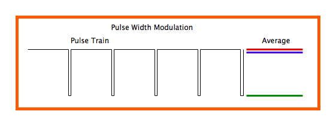

# raspberry-pi-car

Github链接[raspberry-pi-car](https://github.com/PTYin/raspberry-pi-car)

## Installation

    make install
    make server

## Compilation

    make compile # if you just want to compile C program

## Usage

    node app.js
    ./car # or ./carClient

## Structure

- car.c (小车的控制程序源代码)
- distance.c (超声波测距的源代码,作为node服务器进程的子进程)
- carClient.c(socket通信版本的小车控制源码,内包含超声波测距,但会影响服务器响应速度)
- .gitignore(去除了一些文件及文件夹)
- Makefile
  - make install(apt安装依赖，npm安装依赖，编译源代码)
  - make compile(仅编译C代码)
  - make server(启动服务器)

---
(以下fork自Github项目Remote-Camera，并做了部分修改,故以下只讲本项目修改的部分)

- app.js(node服务器入口)
- views
  - index.html(去除了商标，添加了手写的JS ajax代码,不断向服务器请求距离)
- controllers
  - distance.js(响应关于距离探测数据的处理和客户端/服务器端距离的交互)
- config
  - config.js(修改了一些配置并添加了配置)

## Hardware

- 加速度计在项目中应用  

  
  
  - 加速度计静止时只受重力一个力，而重力永远是竖直向下的
  - 通过测定x/y/z轴所受的加速度即获得了重力在x/y/z轴的分量
  - 设重力加速度在yz平面上与z轴夹角为α，则tanα=Fy/Fz。这个α就是要求的roll角，即用math库中反正弦函数得到，同理可得到pitch角，tanβ=Fx/Fz
  - 但是用此方法无法得到yaw角，因为以z轴为转轴转动重力分量不会随转动角度变化而变化。
  - 项目中控制小车前进后退和控制舵机抬头低头是使用加速度计得到角度
- 陀螺仪应用
  - 陀螺仪中有一微小陀螺，永远保持水平
  - 陀螺仪可以读出roll，pitch，yaw三角角速度
  - 通过粗略对yaw角速度积分的方式来求出yaw角
  - 项目中控制舵机转动是使用陀螺仪积分得到角度
- 数据读取及处理
  - MPU6050模块通过I2C通信，首先需要向其各个寄存器写入数据将其初始化
  - 其次通过读取MPU6050寄存器得到加速度计、陀螺仪各轴数据
  - 加速度计读数会有噪音，为了让角度曲线变得更平滑需要降噪算法
  - 本项目采用卡尔曼滤波算法，网上并没有现有c语言代码，代码中kalman滤波算法是从[github C++面向对象项目KalmanFilter](https://github.com/TKJElectronics/KalmanFilter)改写成C语言函数

### 超声波传感器  


- HC-SR04具有两个探头分别是发射探头和接受探头
- 通过<sys/time.h>库中gettimeofday函数来获得时间，用音速乘以时间获得粗略的距离

### 舵机云台



- 项目中有两舵机,仰角舵机和平移舵机
- 通过PWM脉冲时长来控制舵机的转角 0.5ms是0度 1.5ms是90度 2.5ms是180度
- 通过陀螺仪和加速度计获得的角映射到脉冲时长

```c
softPwmWrite(BOTTOMPIN, fYaw1/(1800/BOTTOMRANGE)+15.0);
softPwmWrite(TOPPIN, fNewRoll1/(1800/TOPRANGE)+5.0);
```

### L298N电机控制模块


- 通过GPIO依据上表输出高低电平即可控制电机正转反转
- 前进同为正转，后退同为反转，左右旋转则两电机转动相反

### 其它部件

- 声音传感器
  - 声音传感器接收到声音会输出高电平
- 发光二极管
  - 用于指示灯，注意串联电阻防止烧坏二极管和甚至电源
- usb摄像头
  - 免驱动且利用工具fswebcam即可实现拍照功能

## Server

- 开机自启hotapd热点服务，ssid为pi(利用github项目[oblique/create_ap](https://github.com/oblique/create_ap))
- nodejs服务器(利用github项目[pizn/Remote-Camera](https://github.com/pizn/Remote-Camera))
  - **拍照原理**
    - 为node服务器调用shell子进程，运行命令fswebcam来拍摄照片并储存
  - **查看照片原理**
    - 利用fs.readdir()方法获得photo目录下所有照片，然后再去遍历
  - **实时距离显示原理**
    - 子进程调用本项目第三个程序distance
    - 子进程通过fflush(stdout)不断地输出距离并且冲洗标准输出流内容
    - node父进程通过监听stdout标准输出流获得距离

### 模块

- 登陆模块
- 拍照模块
- 照片查看模块
- 距离模块

## socket通信

- 本项目有两个版本
  - 一个是通过socket通信进行c语言和nodejs服务器通信的，不依赖于服务器的carClient程序，方便调试
  - 另一个是最终更稳定的版本，也就是最终版采用的方式，通过父子进程通信获得超声波距离

## 控制方法

- 声音传感器探测声音，向左手声音传感器吹气来开启或关闭小车响应
- 右手前后左右倾斜控制前后左右
- 右手震荡行走模式和探测模式互换
- 左手转动或前后倾斜控制舵机云台转动（云台上是摄像头和超声波测距模块）

## Material

- 树莓派 3b+
- 小车躯干 两个直流电机 两个轮子 一个万向轮
- usb摄像头
- 声音传感器
- 两个电阻
- 两个发光二极管
- L298N电机驱动模块
- HC-SR04超声波测距模块
- 公对公母对母公对母杜邦线若干
- SYB-170小面包板两个
- 大面包板
- MPU6050六轴陀螺仪加速度计两个
- sg90舵机两个
- 小充电宝

